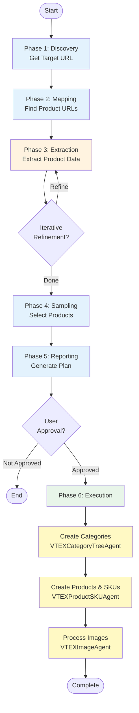
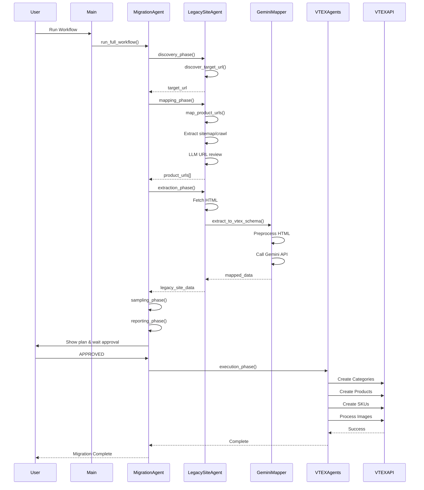

# VTEX Catalog Migration Agent - Architecture Diagram

## System Architecture

```mermaid
graph TB
    subgraph "Entry Point"
        MAIN[main.py<br/>CLI Interface]
    end

    subgraph "Agents Layer"
        MA[MigrationAgent<br/>Orchestrator]
        LSA[LegacySiteAgent<br/>Extraction]
        VCTA[VTEXCategoryTreeAgent<br/>Categories]
        VPSA[VTEXProductSKUAgent<br/>Products & SKUs]
        VIA[VTEXImageAgent<br/>Image Processing]
    end

    subgraph "Tools Layer"
        GM[gemini_mapper.py<br/>LLM Extraction]
        SC[sitemap_crawler.py<br/>URL Discovery]
        VA[vtex_api.py<br/>VTEX API Client]
        VCT[vtex_catalog_tools.py<br/>VTEX Operations]
        IM[image_manager.py<br/>Image Download/Upload]
        UP[url_parser.py<br/>URL Analysis]
    end

    subgraph "Utils Layer"
        SM[state_manager.py<br/>State Persistence]
        LOG[logger.py<br/>Logging]
        VAL[validation.py<br/>Data Validation]
        PM[prompt_manager.py<br/>Custom Prompts]
        EH[error_handler.py<br/>Error Handling]
    end

    subgraph "External Services"
        GEMINI[Google Gemini API<br/>LLM Extraction]
        VTEX_API[VTEX API<br/>Catalog Management]
        GITHUB[GitHub API<br/>Image Storage]
        TARGET_SITE[Target Website<br/>Legacy Site]
    end

    subgraph "State Storage"
        STATE[state/*.json<br/>Persistent State]
        LOGS[logs/*.txt<br/>Log Files]
    end

    %% Entry point connections
    MAIN -->|Full Workflow| MA
    MAIN -->|Legacy Only| LSA
    MAIN -->|Import Only| MA
    MAIN -->|Image Only| VIA

    %% Migration Agent workflow
    MA -->|Step 1: Discovery| LSA
    MA -->|Step 2: Mapping| LSA
    MA -->|Step 3: Extraction| LSA
    MA -->|Step 4: Sampling| LSA
    MA -->|Step 5: Reporting| MA
    MA -->|Step 6: Execution| VCTA
    MA -->|Step 6: Execution| VPSA
    MA -->|Step 6: Execution| VIA

    %% Legacy Site Agent
    LSA -->|Extract URLs| SC
    LSA -->|Extract Data| GM
    LSA -->|Save State| SM

    %% VTEX Agents
    VCTA -->|Create Categories| VA
    VPSA -->|Create Products/SKUs| VA
    VPSA -->|Operations| VCT
    VIA -->|Process Images| IM
    VIA -->|Associate Images| VA

    %% Tools connections
    GM -->|API Calls| GEMINI
    SC -->|HTTP Requests| TARGET_SITE
    VA -->|API Calls| VTEX_API
    IM -->|Upload Images| GITHUB
    IM -->|Download Images| TARGET_SITE

    %% Utils connections
    MA -.->|Logging| LOG
    LSA -.->|Logging| LOG
    VCTA -.->|Logging| LOG
    VPSA -.->|Logging| LOG
    VIA -.->|Logging| LOG
    
    MA -.->|Save/Load| SM
    LSA -.->|Save/Load| SM
    VCTA -.->|Save/Load| SM
    VPSA -.->|Save/Load| SM
    
    SM -.->|Read/Write| STATE
    LOG -.->|Write| LOGS
    
    LSA -.->|Custom Prompts| PM
    GM -.->|Custom Prompts| PM
    
    VPSA -.->|Validate| VAL
    LSA -.->|Validate| VAL

    style MAIN fill:#e1f5ff
    style MA fill:#fff4e1
    style LSA fill:#fff4e1
    style VCTA fill:#fff4e1
    style VPSA fill:#fff4e1
    style VIA fill:#fff4e1
    style GEMINI fill:#e8f5e9
    style VTEX_API fill:#e8f5e9
    style GITHUB fill:#e8f5e9
    style STATE fill:#f3e5f5
    style LOGS fill:#f3e5f5
```

## Workflow Phases

## Data Flow

## Component Details

### Agents

1. **MigrationAgent** - Main orchestrator
   - Coordinates all phases
   - Manages workflow state
   - Handles user interactions

2. **LegacySiteAgent** - Data extraction
   - Discovery: Get target URL
   - Mapping: Find product URLs (sitemap/crawl)
   - Extraction: Extract product data using Gemini

3. **VTEXCategoryTreeAgent** - Category management
   - Creates departments
   - Creates category hierarchy
   - Maps legacy categories to VTEX

4. **VTEXProductSKUAgent** - Product management
   - Creates products
   - Creates SKUs
   - Sets prices and inventory

5. **VTEXImageAgent** - Image processing
   - Downloads images from legacy site
   - Uploads to GitHub
   - Associates with SKUs in VTEX

### Tools

1. **gemini_mapper.py** - LLM extraction engine
   - HTML preprocessing
   - Gemini API integration
   - VTEX schema mapping
   - Retry logic with exponential backoff

2. **sitemap_crawler.py** - URL discovery
   - Sitemap extraction
   - Recursive crawling
   - URL pattern matching

3. **vtex_api.py** - VTEX API client
   - REST API wrapper
   - Error handling
   - Rate limiting

4. **image_manager.py** - Image operations
   - Download from URLs
   - Upload to GitHub
   - Image processing

### Utils

1. **state_manager.py** - State persistence
   - Save/load state files
   - JSON serialization
   - State directory management

2. **logger.py** - Logging system
   - Agent-specific loggers
   - File-based logging
   - Log rotation

3. **validation.py** - Data validation
   - Schema validation
   - Data quality checks

4. **prompt_manager.py** - Custom prompts
   - Store custom extraction rules
   - Prompt editing interface

## State Files

- `01_discovery.json` - Target URL
- `02_mapping.json` - Product URLs
- `03_extraction.json` - Extracted product data
- `legacy_site_extraction.json` - Final extraction results
- `vtex_products_skus.json` - Created VTEX products/SKUs
- `vtex_images.json` - Image associations

## Log Files

- `legacy_site_agent_log.txt` - Legacy site extraction logs
- `migration_agent_log.txt` - Migration workflow logs
- `image_manager_log.txt` - Image processing logs
